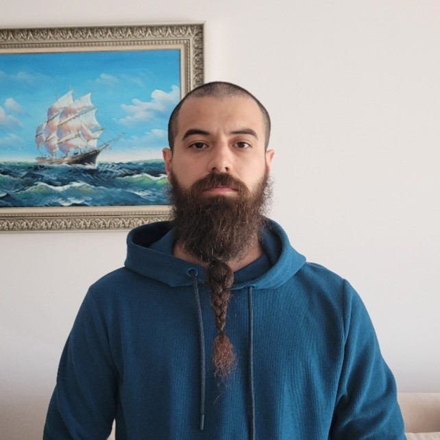

  
  
  
<strong>Erkan ADALI<strong>

  
<strong>Senior Perception Engineer</strong>

  
<em>Tampere, Finland</em>

### Professional Philosophy
I believe that code is only as good as its maintainability. In a documentation-first environment, I prioritize:
1.  **Clarity over Cleverness:** Writing code and docs that the "future me" (and my team) can understand instantly.
2.  **Scalability:** Building systems that grow without increasing technical debt.
3.  **Efficiency:** Automating the mundane so we can focus on solving the difficult problems.

---

### Connect
I’m always open to discussing new projects or technical challenges. 
* **Email:** [erkanadali91@gmail.com]
* **GitHub:** [github.com/eadali]
