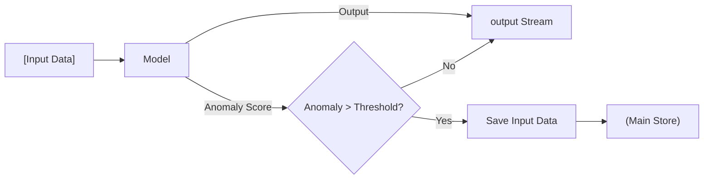

## The Complexity of Sensory Perception
<figure style="text-align: center; margin-bottom: 20px;">
  

    
  

  <figcaption style="margin-top: 10px; font-size: 0.9em; color: #555; font-style: italic;">
    Radar sensor stream from the MOANA dataset (Jang et al., 2025).
  </figcaption>
</figure>
Real-world data is inherently messy, characterized by its continuous nature, high dimensionality, and inevitable noise. Unlike controlled datasets, information from sensors like cameras arrives as a relentless stream of complex, overlapping signals. A single "snapshot" may contain thousands of features that require simultaneous processing, while environmental interference and hardware limitations further distort the digital representation of physical phenomena.

---
## Adapting to Uncertainty in Unseen Domains
Even with sophisticated capabilities, modern systems often encounter unseen domains—environments or scenarios that fall outside their initial training data. In these unfamiliar contexts, the inherent noise and complexity of real-world data can lead to high uncertainty, making automated interpretations unreliable. To maintain safety and operational integrity, it is crucial for a system to recognize its own limitations; when the gap between its internal logic and the raw sensory input becomes too vast, the system must proactively request help from a supervisor. This "human-in-the-loop" approach ensures that expert intervention can bridge the gap in understanding, providing the necessary guidance to navigate novel or high-stakes situations that the system cannot yet confidently interpret.

---
## Automated Data Curation and Continuous Learning

When these systems identify inputs that fall within an unseen domain, they do more than just request intervention. The detection of such unfamiliar scenarios triggers an automated process to archive the relevant sensory inputs, effectively flagging them as high-value edge cases. By selectively capturing these challenging or novel samples from the high-dimensional sensor stream, the system builds a specialized repository for future training cycles. This mechanism ensures that once a human supervisor provides the necessary guidance, the specific encounter is not lost; instead, it is transformed into a learning opportunity that progressively expands the system's robustness and minimizes future uncertainty.

---
## The Failure of Manual Logic
Human intuition alone cannot scale to this level of complexity. We simply cannot write enough "if-then" rules to cover the infinite variety of the real world. Because these patterns are too intricate for manual programming, the system must learn to extract its own logic directly from the data it encounters. By moving away from rigid, human-coded instructions and toward a model that learns in a reasonable, data-driven way, the system can discover hidden relationships that our own biases might overlook. This ensures the machine's growth is grounded in actual experience rather than the limited scope of human foresight.

## References
* Jang, H., et al. (2025). MOANA: Multi-radar dataset for maritime odometry and autonomous navigation application. The International Journal of Robotics Research.
