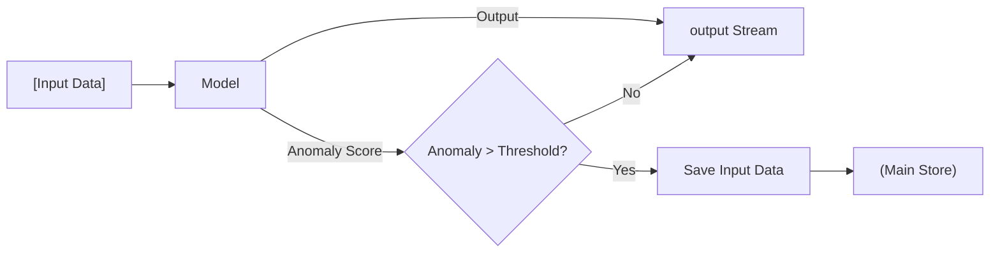

<table>
  <tr>
    <td></td>
    <td></td>
  </tr>
</table>

## The Complexity of Raw Sensory Perception

  
  

Real-world data is inherently messy, characterized by its continuous nature, high dimensionality, and the inevitable presence of noise. Unlike the clean, discrete datasets often used in controlled environments, information captured via cameras or sensor modalities—such as LiDAR, thermal imaging, or microphones—exists as a relentless stream of overlapping signals. High dimensionality arises because a single "snapshot" of the world contains thousands of features (pixels, frequencies, or coordinates) that an algorithm must interpret simultaneously. Furthermore, environmental interference and hardware limitations introduce noise, creating a significant gap between the raw physical phenomena and the digital representation.

Here is a blog post detailing the evolution of these advanced systems, focusing on the core pillars of their development.

---

## 1. Bridging the Gap: Real-World Understanding

For a long time, digital systems lived in a vacuum of abstract logic. We are changing that by engineering systems that don't just process inputs, but truly **understand the physical and contextual nuances of the real world**.

By integrating multi-sensory data streams, these systems can interpret spatial relationships, environmental dynamics, and human intent. This transition from "data processing" to "situational awareness" allows technology to move out of the screen and into our physical lives with unprecedented accuracy.

## 2. The Power of Persistent State

Efficiency in complex environments requires more than just high-speed calculation; it requires a **persistent data narrative**. While traditional architectures often treat every interaction as a blank slate, our systems utilize a continuous historical ledger of information.

By maintaining a **long-term data repository**, these systems can recall past experiences, recognize recurring patterns, and build upon previous successes. This continuity ensures that the system evolves alongside the user, growing more specialized and effective over time without needing to be "re-taught" the basics.

## 3. Logical Architectures: Reasoning and Strategy

True intelligence is defined by the ability to navigate ambiguity. We are building systems capable of **complex reasoning and strategic foresight**. Instead of following a rigid script, these architectures can break down a high-level objective into actionable phases.

They evaluate multiple pathways, weigh potential outcomes, and adjust their trajectory based on real-time feedback. This capacity for internal deliberation allows the system to handle multi-step challenges that require logic, deduction, and tactical execution, ensuring the most efficient path to a goal is always taken.

## 4. Engineering for Control and Safety

As systems become more autonomous, the frameworks governing them must become more robust. Our development philosophy prioritizes **controllability and safety** as foundational features, not afterthoughts.

* **Verifiable Constraints:** Implementing hard-coded guardrails that ensure the system remains within predefined operational boundaries.
* **Transparency:** Designing architectures where the logic behind a decision is traceable and understandable.
* **Human-in-the-Loop:** Creating seamless hand-off points where human oversight can redirect the system’s logic instantly.

By focusing on these four pillars, we aren't just building faster tools—we are building a reliable foundation for the future of automated systems.

---

