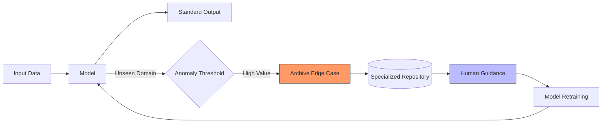

# The Complexity of Sensory Perception
<figure style="text-align: center; margin-bottom: 20px;">
  

    
  

  <figcaption style="margin-top: 10px; font-size: 0.9em; color: #555; font-style: italic;">
    Multi-modal sensor streams (Camera and Radar) from the MOANA dataset (Jang et al., 2025).
  </figcaption>
</figure>
Real-world data is inherently messy, characterized by its continuous nature, high dimensionality, and inevitable noise. A single "snapshot" may contain thousands of features that require simultaneous processing, while environmental interference and hardware limitations further distort the digital representation of physical phenomena.

---
## Beyond Detection
While modern computer vision models already outperform humans, visual recognition is now a baseline. The real value lies in reasoning. True intelligence isn’t just labeling a scene, but understanding the context and logical relationships to predict what happens next.

---
## Smart Curation: Closing the Learning Loop

When encountering unknown scenarios, the system doesn’t just ask for help—it flags and archives the sensor data as a high-value edge case. These samples are stored for future training, ensuring human feedback permanently expands the system's robustness.

---
## The Failure of Manual Logic
Human intuition alone cannot scale to this level of complexity. We simply cannot write enough "if-then" rules to cover the infinite variety of the real world. Because these patterns are too intricate for manual programming, the system must learn to extract its own logic directly from the data it encounters. By moving away from rigid, human-coded instructions and toward a model that learns in a reasonable, data-driven way, the system can discover hidden relationships that our own biases might overlook. This ensures the machine's growth is grounded in actual experience rather than the limited scope of human foresight.

## References
* Jang, H., et al. (2025). MOANA: Multi-radar dataset for maritime odometry and autonomous navigation application. The International Journal of Robotics Research.
