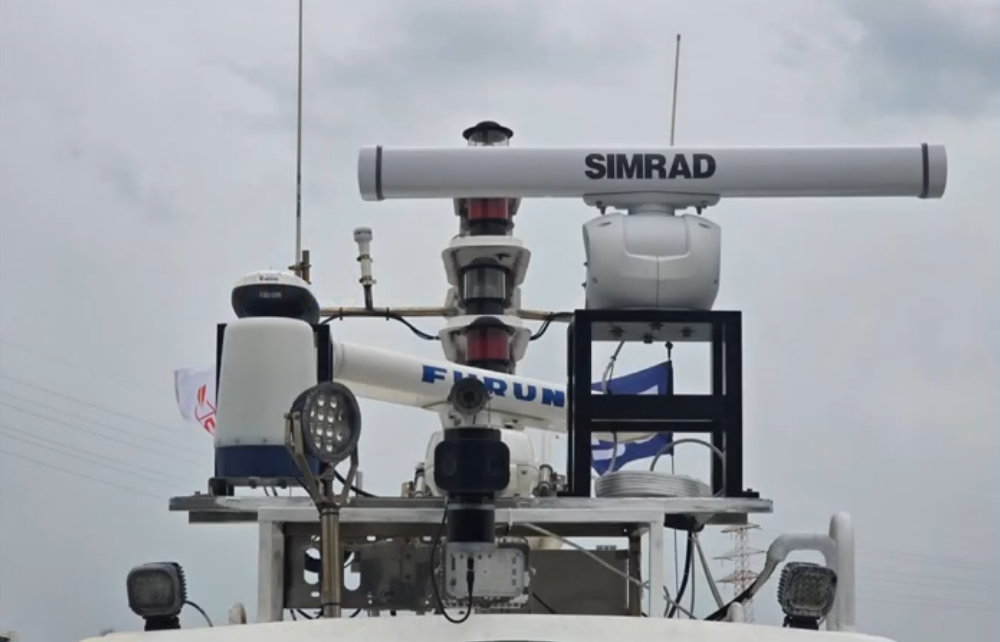
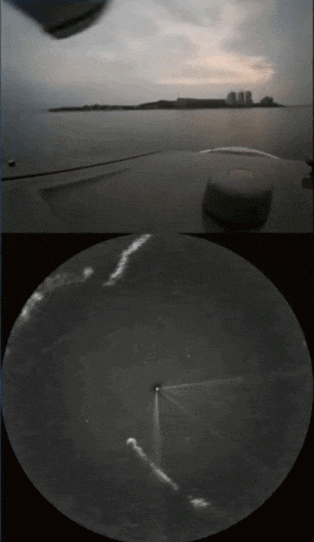
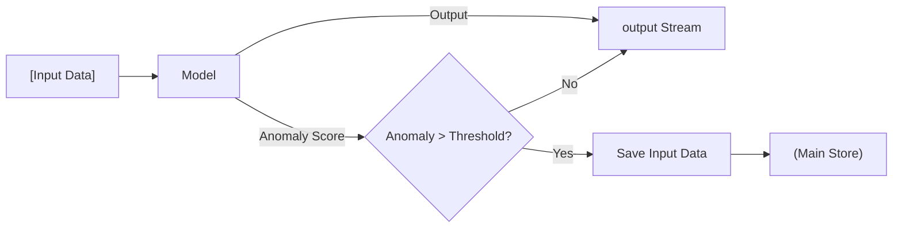

---
## The Complexity of Raw Sensory Perception

  
  

Real-world data is inherently messy, characterized by its continuous nature, high dimensionality, and the inevitable presence of noise. Unlike the clean, discrete datasets often used in controlled environments, information captured via cameras or sensor modalities—such as LiDAR, thermal imaging, or microphones—exists as a relentless stream of overlapping signals. High dimensionality arises because a single "snapshot" of the world contains thousands of features (pixels, frequencies, or coordinates) that an algorithm must interpret simultaneously. Furthermore, environmental interference and hardware limitations introduce noise, creating a significant gap between the raw physical phenomena and the digital representation.

---
## Adapting to Uncertainty in Unseen Domains
Even with sophisticated capabilities, modern systems often encounter unseen domains—environments or scenarios that fall outside their initial training data. In these unfamiliar contexts, the inherent noise and complexity of real-world data can lead to high uncertainty, making automated interpretations unreliable. To maintain safety and operational integrity, it is crucial for a system to recognize its own limitations; when the gap between its internal logic and the raw sensory input becomes too vast, the system must proactively request help from a supervisor. This "human-in-the-loop" approach ensures that expert intervention can bridge the gap in understanding, providing the necessary guidance to navigate novel or high-stakes situations that the system cannot yet confidently interpret.

---
## Automated Data Curation and Continuous Learning

When these systems identify inputs that fall within an unseen domain, they do more than just request intervention. The detection of such unfamiliar scenarios triggers an automated process to archive the relevant sensory inputs, effectively flagging them as high-value edge cases. By selectively capturing these challenging or novel samples from the high-dimensional sensor stream, the system builds a specialized repository for future training cycles. This mechanism ensures that once a human supervisor provides the necessary guidance, the specific encounter is not lost; instead, it is transformed into a learning opportunity that progressively expands the system's robustness and minimizes future uncertainty.

